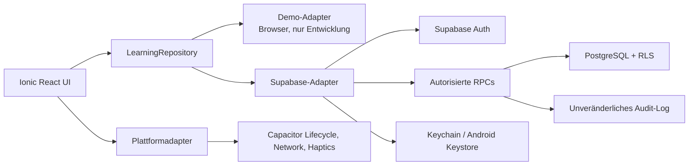

# Architekturüberblick

## Laufzeitgrenzen

React-Seiten greifen nie direkt auf Tabellen zu. Der Repository-Vertrag trennt UI, Demo und Supabase. TanStack Query hält ausschließlich Servercache; Auth- und Quizablauf bleiben in kleinen lokalen Zuständen.

## Quizzustand

Eine Sitzung fixiert Frage-ID, Version, Reihenfolge und einen Snapshot. Nur die aktuelle Frage erhält eine Deadline. Nach der ersten erfolgreichen Abgabe erzeugt der Server genau einen unveränderlichen Versuch und aktualisiert die abgeleitete Nutzerstatistik atomar. Erst `advance_quiz_session` aktiviert die nächste Deadline. Dadurch läuft während einer Trainingsauflösung kein Timer.

## Datenminimierung

Eigene Tabellen speichern keine Passwörter. Profile enthalten nur Anzeigename, Rolle und Löschzeitpunkt; die E-Mail bleibt bei Supabase Auth. Konto- und Lernhistorie werden durch kaskadierende Löschung entfernt. Produktionsspezifische Aufbewahrungsregeln müssen vor Release juristisch festgelegt werden.
