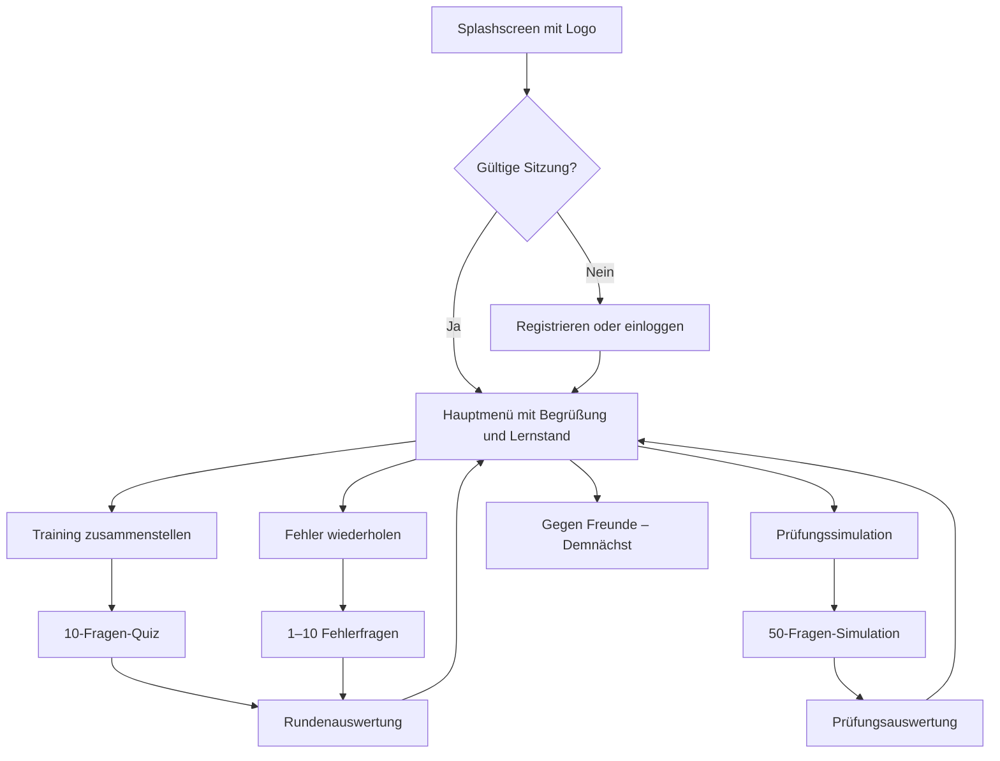

# Design: 34d-Lernapp MVP

## 1. Context

Das Produkt ist eine neue Lernanwendung für deutschsprachige Prüflinge der Sachkundeprüfung Versicherungsvermittlung nach § 34d GewO. Es gibt noch keine bestehende Codebasis. Der MVP benötigt eine gemeinsame Oberfläche für iOS, Android und Web, persistente Nutzerkonten, serverseitig gepflegte Fragen, nachvollziehbaren Lernfortschritt und einen redaktionellen Adminprozess.

Die fachlichen Inhalte sind veränderlich und teilweise rechtlich sensibel. Das System darf fachliche Richtigkeit deshalb nicht aus dem Programmcode ableiten. Es stellt Werkzeuge für Quelle, Version, Freigabe und Wiedervorlage bereit; die fachliche Verantwortung verbleibt bei benannten Prüfern.

## 2. Goals and Non-Goals

### Goals

- Eine gemeinsame, wartbare Ionic-React-/TypeScript-Codebasis für iOS, Android und PWA.
- Ein klarer, schneller Quizablauf mit eigenständigem Markenauftritt.
- Serverseitig abgesicherte Nutzer-, Fragen-, Antwort- und Adminprozesse.
- Messbarer Lernstand pro Gesamtbestand, Bereich und Sparte.
- Korrekte, testbare Umsetzung der internen Prüfungssimulation.
- Redaktionell sichere Fragepflege einschließlich Quellen und Jahreszahlen-Review.

### Non-Goals

- Kein Multiplayer im MVP.
- Keine exakte Nachbildung der offiziellen IHK-Prüfungssoftware.
- Keine Unterstützung weiterer Fragearten.
- Keine automatische Rechtsprüfung oder automatische Inhaltsgenerierung.
- Kein Offline-first-Synchronisationssystem.

## 3. Architecture Decision

### 3.1 Client

Es wird ein TypeScript-Monorepository mit einer Ionic-React-Anwendung, einem Vite-Webbuild und den von Capacitor verwalteten nativen Projekten `ios/` und `android/` verwendet. Die jeweils neuesten gegenseitig kompatiblen stabilen Versionen werden zu Projektbeginn gewählt und anschließend über den Lockfile fixiert.

- Ionic React und Ionic Web Components als adaptive Komponentenbasis; Layoutseiten verwenden die Ionic-Seitenstruktur und eigene Design Tokens über CSS Custom Properties.
- TypeScript im Strict Mode; Domänentypen und Zod-Schemas teilen den Laufzeit- und Compile-Time-Datenvertrag.
- Die von der gewählten Ionic-Version offiziell unterstützte Kombination aus `IonReactRouter`, `IonRouterOutlet` und React Router für URL-Routing, mobile Navigationsstacks, Auth-Guards und direkt ladbare Webrouten. React Router wird nicht unabhängig von Ionic aktualisiert.
- TanStack Query verwaltet serverseitigen Cache, Lade-/Fehlerzustände, Invalidierung und kontrollierte Wiederholungen.
- React Context, Hooks und zustandsbasierte Reducer verwalten ausschließlich lokalen UI-, Timer- und Quizablauf; es wird kein zweiter globaler Servercache eingeführt.
- React Hook Form und Zod validieren Auth-, Profil- und Adminformulare.
- Repository-Schnittstellen zwischen React-Oberfläche und Supabase halten Fachlogik unabhängig testbar und verhindern direkte Datenbankaufrufe aus Seitenkomponenten.
- Unveränderliche TypeScript-Domainobjekte und explizite DTO-Mapper trennen Serverpayload, UI-Modell und Adminmodell.
- Auth-Tokens werden auf iOS/Android über einen geprüften Capacitor-Storage-Adapter mit Keychain-/Keystore-Unterstützung und im Web über die vorgesehene Auth-SDK-Persistenz gespeichert. Nicht sensible UI-Einstellungen dürfen Capacitor Preferences verwenden.
- Keine richtige Antwort wird mit dem initialen Fragen-Payload an Lernende übertragen.

Der Adminbereich lebt in derselben Ionic-React-Anwendung unter einer geschützten Route wie `/admin`. Dadurch werden Designsystem, Authentifizierung und Datenvertrag geteilt. Die Bedienung ist PWA-first; auf kleinen Displays bleibt sie funktionsfähig, darf aber auf die Nutzung am Desktop hinweisen.

### 3.2 Backend

Supabase stellt bereit:

- Authentifizierung per E-Mail und Passwort.
- PostgreSQL als kanonische Datenbank.
- Row Level Security für alle von Clients erreichbaren Tabellen.
- RPCs oder Edge Functions für Quiz-Zusammenstellung, Antwortabgabe, Sitzungsabschluss, Prüfungsauswertung und Adminimport.
- Storage für Marken- und optionale redaktionelle Assets.
- Datenbankmigrationen im Repository; keine manuellen Produktionsänderungen.

Die Auswahl und Bewertung von Fragen erfolgt serverseitig. Der Client erhält vor Abgabe nur Prompt, vier Antworten, Taxonomie, Frage-ID, Sitzungs-ID und serverseitige Deadline. Nach einer Trainingsabgabe liefert der Server Ergebnis, richtige Antwort und Erklärung. In der Prüfungssimulation hält der Server richtige Antwort und Erklärung bis zum Abschluss zurück.

### 3.3 Online-Verhalten

Der MVP ist online-first. Der statische PWA-Shell darf gecacht werden, Quizstart und Antwortabgabe benötigen jedoch eine Verbindung. Jede Antwort wird unmittelbar serverseitig gespeichert. Bei einem Verbindungsfehler bleibt die Auswahl gesperrt, der Client wiederholt die idempotente Abgabe und zeigt einen verständlichen Status. Ein Neustart stellt eine aktive Sitzung aus dem Backend wieder her; die Deadline läuft anhand der Serverzeit weiter.

### 3.4 Capacitor and PWA Boundary

- Der Vite-Produktionsbuild erzeugt den einzigen Web-Artefaktbestand. Capacitor synchronisiert genau diesen Build in die nativen iOS- und Android-Projekte.
- Native Besonderheiten werden hinter kleinen Plattformadaptern gekapselt. Seitenkomponenten fragen nicht direkt Betriebssystem oder Plugin ab.
- Der Capacitor-App-Lebenszyklus steuert Hintergrund/Vordergrund, Deep Links, Passwortreset-Rückkehr und Android-Hardware-Zurück. Die Timerdeadline bleibt serverautoritativ.
- Der Capacitor-Network-Status dient nur zur verständlichen UI-Rückmeldung; die tatsächliche Serverantwort bleibt maßgeblich.
- Haptisches Feedback ist eine optionale, reduzierte Ergänzung zu sichtbaren Zuständen und wird bei Reduced Motion beziehungsweise deaktivierter Haptik unterlassen.
- Die PWA verwendet einen versionierten Service Worker. App-Shell und statische Markenassets dürfen gecacht werden; Authantworten, Quizpayloads, Lösungen und personenbezogene Daten dürfen nicht in einen öffentlichen Cache gelangen.
- Native Plattformdateien werden versioniert und nach jeder Plugin- oder Webbuild-Änderung reproduzierbar synchronisiert.

## 4. Information Architecture and User Flows

### 4.1 Primary Flow



### 4.2 Main Menu

Das Hauptmenü zeigt:

- Begrüßung mit Anzeigename.
- Kompakte Lernstandskarte mit Gesamtlernstand, bearbeiteten Fragen und aktivem Fehlerpool.
- Primäre Kachel „Trainieren“.
- Kachel „Fehler wiederholen“ mit Anzahl offener Fehler.
- Kachel „Prüfungssimulation“.
- Deaktivierte Kachel „Gegen Freunde spielen“ mit „Demnächst verfügbar“.
- Zugang zu Profil, Datenschutz, Impressum, Disclaimer und Logout.

### 4.3 Training Composer

Die Auswahl zeigt zunächst die fünf Bereiche A–E und darunter aufklappbar die Sparten. Ein Bereich kann als Ganzes gewählt werden; einzelne Sparten können anschließend ein- oder ausgeschaltet werden. Die effektive Auswahl ist die Vereinigung aller ausgewählten Sparten. Die Oberfläche zeigt live die Zahl veröffentlichter, geeigneter Fragen. Start ist erst ab zehn geeigneten Fragen möglich.

### 4.4 Quiz Screen

- Kopfzeile: Modus, Frage `n/10` beziehungsweise `n/50` und Schließen-Aktion.
- Zeitbalken: 45 Sekunden linear von voll nach leer, zusätzlich verbleibende Sekunden als Text.
- Fragekarte: langer, scrollbar eingebetteter Fragetext ohne horizontales Scrollen.
- Vier Antwortkarten: ausreichend große Touch-Ziele; zufällige Reihenfolge ist im MVP nicht vorgesehen, weil `richtige_antwort` auf den importierten Index verweist.
- Nach Auswahl sind alle Antworten sofort gesperrt.
- Richtig im Training: gewählte Karte grün, kurze positive Animation, Erklärung optional aufklappbar, Schaltfläche „Weiter“.
- Falsch oder Timeout im Training: gewählte Karte rot, richtige Karte grün, Erklärung sichtbar, Schaltfläche „Weiter“.
- Prüfungssimulation: neutrale Bestätigung ohne Richtig/Falsch und direkte Fortsetzung; Auflösung erst am Ende.

## 5. Taxonomy

Die kanonische Taxonomie wird per Seed-Migration angelegt und im Adminbereich nicht frei umbenannt, solange Fragen darauf verweisen.

| Bereich | Anzeigename | Sparten |
|---|---|---|
| A | Private Vorsorge & AV | Gesetzliche Rentenversicherung; Private Rentenversicherung; Lebensversicherung; Betriebliche Altersversorgung (bAV) |
| B | Kranken- und Unfallversicherung | Private Krankenversicherung; Pflegeversicherung; Unfallversicherung |
| C | Rechtliche Grundlagen | Versicherungsvertragsgesetz (VVG); Vermittlerrecht; Wettbewerbsrecht; Rechtliche Rahmenbedingungen für die Beratung |
| D | Sachversicherungen I | Wohngebäudeversicherung; Hausratversicherung |
| E | Sachversicherungen II & Haftpflicht | Haftpflichtversicherung; Rechtsschutzversicherung; Kraftfahrtversicherung |

Jede Frage gehört genau zu einem Bereich und genau zu einer Sparte. Die Bereichszuordnung wird aus der Sparte abgeleitet und darf nicht widersprüchlich gespeichert werden.

## 6. Question JSON Contract

### 6.1 Required Import Shape

Der Import akzeptiert ein einzelnes Objekt oder ein Array aus Objekten. Die vom Auftraggeber vorgegebenen sechs Kernfelder bleiben erhalten:

```json
{
  "frage": "Sie sprechen mit Herrn Krause, dem Inhaber der Fa. Krause GmbH, über den begünstigten Personenkreis der arbeitgeberfinanzierten betrieblichen Altersversorgung (bAV). Dabei fragt Herr Krause, ob er allen seinen Arbeitnehmern eine bAV gewähren muss.",
  "antworten": [
    "Es ist zulässig, Personen objektiv abzugrenzen, indem Sie eine Mindestbeschäftigungszeit vorgeben.",
    "Ja, wenn Sie einem Mitarbeiter eine bAV gewähren, müssen auch alle anderen eine bekommen.",
    "Nein, Sie können zum Beispiel Teilzeitkräfte ausschließen.",
    "Sie allein entscheiden, wer eine bAV erhält."
  ],
  "richtige_antwort": 0,
  "sparte": "Betriebliche Altersversorgung (bAV)",
  "erklärung": "Es ist zulässig, Personen objektiv abzugrenzen, indem eine Mindestbeschäftigungszeit vorgegeben wird.",
  "änderungsanfällig": false,
  "quelle": {
    "titel": "Fachlich freigegebene Quelle",
    "url": "https://example.org/quelle",
    "stand": "2026-08-10"
  },
  "zuletzt_geprüft_am": "2026-08-10",
  "nächste_prüfung_am": null,
  "version": 1,
  "prüfverantwortlich": "Redaktion"
}
```

Optionale Metadaten dürfen beim Import fehlen, solange die Frage als Entwurf gespeichert wird. Für eine Veröffentlichung sind Quelle, Prüfdatum, Version und Prüfverantwortlicher erforderlich.

### 6.2 Validation

- `frage`: nicht leer, nach Trim maximal 2.000 Zeichen.
- `antworten`: Array mit exakt vier nicht leeren, paarweise unterschiedlichen Strings; je maximal 500 Zeichen.
- `richtige_antwort`: Ganzzahl 0, 1, 2 oder 3.
- `sparte`: exakter oder administrativ bestätigter Alias einer kanonischen Sparte.
- `erklärung`: nicht leer, maximal 4.000 Zeichen.
- `änderungsanfällig`: Boolean.
- `quelle.url`: HTTPS-URL, sofern eine URL angegeben wird.
- `version`: positive Ganzzahl.
- Datumsfelder: ISO-8601-Kalenderdatum.

Der Import normalisiert Unicode nach NFC, entfernt ungewollte Steuerzeichen, vereinheitlicht Zeilenenden und repariert bekannte UTF-8/Windows-1252-Mojibake-Muster wie `ü` zu `ü`. Alle Änderungen erscheinen in einer Vorschau. Grammatik, Zeichensetzung und Fachinhalt werden nicht automatisch umformuliert.

### 6.3 Change-Sensitive Number Rule

Intern wird zusätzlich `contains_time_sensitive_numbers` erfasst. `änderungsanfällig = true` ist nur zulässig, wenn:

1. die Frage in Bereich A oder B liegt,
2. `contains_time_sensitive_numbers = true` gesetzt ist,
3. eine belastbare Quelle vorhanden ist und
4. `nächste_prüfung_am` gesetzt ist.

Der Prüfhinweis ist ausschließlich für Admins sichtbar. Bei einer bestätigten Prüfung setzt das System `zuletzt_geprüft_am` auf das Prüfdatum und schlägt als nächste Prüfung ein Jahr später vor; der Admin kann das Datum fachlich begründet ändern.

## 7. Data Model

### 7.1 Core Tables

| Tabelle | Zweck | Wesentliche Felder |
|---|---|---|
| `profiles` | Nutzerprofil und Rolle | `user_id`, `display_name`, `role`, `created_at`, `deleted_at` |
| `areas` | Bereiche A–E | `id`, `code`, `name`, `sort_order` |
| `subjects` | Sparten | `id`, `area_id`, `name`, `slug`, `sort_order`, `active` |
| `questions` | Aktueller redaktioneller Stand | `id`, `subject_id`, `prompt`, `answers_json`, `correct_index`, `explanation`, `status`, `version`, Review-Felder, Zeitstempel |
| `question_sources` | Quellenbeleg | `question_id`, `title`, `url`, `source_date`, `notes` |
| `question_versions` | Unveränderliche Versionen | Snapshot der fachlichen Felder, `version`, `changed_by`, `change_reason`, `created_at` |
| `quiz_sessions` | Runde und Status | `id`, `user_id`, `mode`, `status`, `started_at`, `completed_at`, `abandoned_at`, `selection_json` |
| `quiz_session_questions` | Fixierte Reihenfolge und Deadline | `session_id`, `question_id`, `question_version`, `position`, `deadline_at` |
| `answer_attempts` | Unveränderliche Antworten | `id`, `session_id`, `question_id`, `question_version`, `selected_index`, `is_correct`, `timed_out`, `answered_at`, `response_ms` |
| `user_question_stats` | Schneller aktueller Lernstand | `user_id`, `question_id`, `attempts`, `correct_attempts`, `incorrect_attempts`, `last_was_correct`, `last_attempt_at` |
| `admin_audit_log` | Nachvollziehbare Redaktion | `actor_id`, `action`, `entity_type`, `entity_id`, `before_json`, `after_json`, `created_at` |

### 7.2 Status Values

- Frage: `draft`, `published`, `archived`.
- Quizsitzung: `active`, `completed`, `abandoned`.
- Modus: `training`, `mistakes`, `exam`.

Veröffentlichte Fragen werden nicht hart gelöscht. Änderungen erzeugen vor dem Überschreiben einen Versionssnapshot. Bereits beantwortete Versuche bleiben auf ihre damalige Frageversion bezogen.

## 8. Quiz Selection and Scoring

### 8.1 Training

- Die effektive Filtermenge besteht aus den ausgewählten Sparten.
- Geeignet sind nur veröffentlichte, nicht archivierte Fragen.
- Der Server wählt zehn unterschiedliche Fragen ohne Zurücklegen zufällig aus der gesamten geeigneten Menge.
- Zwischen mehreren ausgewählten Sparten wird im MVP keine feste Quote garantiert.
- Bei weniger als zehn geeigneten Fragen startet keine Runde; die UI zeigt den verfügbaren Bestand.
- Die Reihenfolge wird beim Start fixiert und bleibt bei Wiederherstellung identisch.

### 8.2 Mistake Practice

- Der aktive Fehlerpool enthält veröffentlichte Fragen, deren letzter Versuch falsch war.
- Es werden zufällig bis zu zehn unterschiedliche Fragen gewählt.
- Anders als normales Training darf eine Fehlerunde bereits mit einer Frage starten.
- Eine richtige Wiederholung setzt `last_was_correct = true` und entfernt die Frage aus dem aktiven Pool.
- Frühere Fehlversuche bleiben in Historie und Kennzahlen enthalten.

### 8.3 Exam Simulation

- Voraussetzung sind mindestens zehn veröffentlichte Fragen in jedem Bereich A–E.
- Der Server wählt je Bereich zehn unterschiedliche Fragen, insgesamt 50, und mischt die Gesamtreihenfolge.
- Während der Runde werden keine korrekten Lösungen offengelegt.
- Pro Bereich wird `richtige Antworten / 10 × 100` berechnet.
- Bestanden ist die Simulation genau dann, wenn mindestens vier Bereiche mindestens 50 Prozent erreichen und jeder weitere Bereich mindestens 30 Prozent erreicht.
- Bei fünf Bereichen mit mindestens 50 Prozent ist die Simulation ebenfalls bestanden.
- Ein Timeout zählt als falsch.
- Abgebrochene Simulationen erhalten kein Bestanden/Nicht-bestanden-Ergebnis.

## 9. Timer and Session State

Der Server setzt beim Anzeigen einer Frage eine autoritative `deadline_at` von 45 Sekunden. Der Client animiert den Balken anhand der Differenz zwischen synchronisierter Serverzeit und Deadline.

- 45–16 Sekunden: primärer Dunkelgrün-Ton.
- 15–6 Sekunden: Warnfarbe; zusätzlich Text, nicht nur Farbe.
- 5–0 Sekunden: Fehlerfarbe und reduzierte, barrierearme Pulsanimation, sofern Bewegung nicht reduziert ist.
- Bei App-Hintergrund oder Browser-Tabwechsel läuft die Deadline weiter.
- Bei Rückkehr nach Deadline löst der Client die idempotente Timeout-Abgabe aus.
- Mehrfache Abgaben derselben Sitzungsfrage erzeugen höchstens einen Versuch und liefern dasselbe Ergebnis.
- Während die Trainingsauflösung sichtbar ist, läuft kein Timer für die nächste Frage.

## 10. Learning Metrics

Zwei Werte werden getrennt gezeigt, um Fehlinterpretationen zu vermeiden:

- **Trefferquote:** richtige Versuche geteilt durch alle abgeschlossenen Versuche im gewählten Zeitraum.
- **Lernstand:** Anteil der mindestens einmal bearbeiteten, aktuell veröffentlichten Fragen, deren letzter Versuch richtig war.

Zusätzlich werden gezeigt:

- Zahl unterschiedlicher bearbeiteter Fragen.
- Abdeckung: bearbeitete unterschiedliche Fragen geteilt durch veröffentlichte Fragen.
- Aktiver Fehlerpool.
- Werte je Bereich und je Sparte.
- Letzte Runden mit Datum, Modus, Punkten, Quote und Dauer.

Eine Runde zeigt Punktzahl, Prozent, richtige und falsche Antworten, Gesamtzeit, durchschnittliche Antwortzeit, Aufschlüsselung nach Bereich/Sparte und eine Fehlerliste mit gewählter Antwort, richtiger Antwort und Erklärung.

## 11. Security and Privacy

- RLS erzwingt, dass Lernende ausschließlich eigene Profile, Sitzungen, Versuche und Statistiken lesen oder verändern können.
- Lernende lesen nur veröffentlichte Frage-Metadaten und erhalten Lösungen ausschließlich über autorisierte Bewertungsfunktionen.
- Adminrechte werden als serverseitig geprüfte Rolle beziehungsweise Custom Claim durchgesetzt; das Ausblenden einer Route genügt nicht.
- Adminänderungen werden protokolliert; Audit-Datensätze sind für Lernende unsichtbar.
- Login-, Registrierungs- und Passwortreset-Endpunkte verwenden Rate Limits und generische Fehlermeldungen gegen Account Enumeration.
- Passwörter werden ausschließlich vom Auth-Anbieter verarbeitet und nie in eigenen Tabellen gespeichert.
- Öffentliche Veröffentlichung setzt Datenschutzerklärung, Impressum, Nutzungsbedingungen und Kontaktweg voraus.
- Nutzer können ihr Konto in der App löschen. Die Löschung entfernt oder anonymisiert personenbezogene Profildaten und Lernhistorie nach dokumentierter Aufbewahrungsregel.
- Analyse- oder Crashdaten dürfen keine Fragetexte, Antworten, E-Mail-Adressen oder Auth-Tokens enthalten.

## 12. Brand and UI System

Das gelieferte Logo ist 3.221 × 1.533 Pixel groß und verwendet im Wesentlichen:

- Brand Lime: `#BFE560`.
- Brand Dark Green: `#3C806B`.

Das Lime dient als Fläche und Akzent, nicht als Textfarbe auf Weiß. Interaktive Primärflächen verwenden Dunkelgrün mit kontrastgeprüfter Schrift. Für richtig/falsch werden semantische Farben verwendet, die zusätzlich durch Icon, Text und Zustand kommuniziert werden.

Der Stil übernimmt nur allgemeine Interaktionsmuster wie Kartenlayout, Fortschrittsanzeige und Antwortanimationen. Es werden keine geschützten Namen, Grafiken, Sounds, Texte oder eine verwechselbare 1:1-Gestaltung einer bestehenden Quiz-App kopiert.

Der Produktname wird über Build-Konfiguration und Lokalisierungsressourcen geliefert. Bis zur Namensentscheidung verwenden interne Dokumente „34d-Lernapp“; die UI darf keinen provisorischen Namen fest verdrahten.

## 13. Accessibility and Responsive Behavior

- Ziel ist WCAG 2.2 AA für die PWA und gleichwertige native Semantik.
- Mindest-Touchziel 44 × 44 logische Pixel.
- Dynamische Schriftvergrößerung ohne abgeschnittene Frage- oder Antworttexte.
- Screenreader-Labels für Timer, Fortschritt, Antwortzustand und Ergebnisdiagramme.
- Fokusreihenfolge und Tastaturbedienung für alle PWA-Kernabläufe.
- Farbe ist nie der einzige Informationsträger.
- Systempräferenz „Bewegung reduzieren“ deaktiviert nicht notwendige Antwort- und Timeranimationen.
- Hoch- und Querformat bleiben nutzbar; Quiz ist mobil-first, Admin tabellenorientiert ab Tablet/Desktop.

## 14. Error Handling

- Formulare zeigen feldnahe, deutsche Fehlertexte.
- Ein fehlgeschlagener Quizstart verändert keinen Lernstand.
- Bei Netzwerkfehler nach Antwortwahl bleibt die Auswahl sichtbar und gesperrt; „Erneut versuchen“ sendet dieselbe Idempotency-ID.
- Bei serverseitig bereits beantworteter Frage wird das gespeicherte Ergebnis wiederhergestellt.
- Wird eine aktive Frage während einer Sitzung archiviert, bleibt der fixierte Versionssnapshot für die Sitzung auswertbar.
- Bei nicht mehr gültiger Auth-Sitzung wird nach Re-Login zur aktiven Runde zurückgeführt, sofern sie noch existiert.
- Importfehler werden pro Datensatz und Feld angezeigt; ein fehlerhafter Batch wird nicht teilweise veröffentlicht.

## 15. Observability

Erfasst werden technische, datensparsame Ereignisse:

- Appstart erfolgreich/fehlgeschlagen.
- Authentifizierungsfehler als Fehlerklasse ohne E-Mail.
- Quizstart, Sitzungsabschluss und Sitzungsabbruch mit Modus und anonymisierter Sitzungs-ID.
- Antwortabgabe-Latenz und technische Fehler, aber weder Fragetext noch gewählte Antwort.
- Adminimport mit Anzahl gültiger/ungültiger Datensätze und Actor-ID im geschützten Audit-Log.

Produktmetriken wie Completion Rate und Fehlerquote werden aggregiert. Personenbezogenes Tracking oder Werbung ist nicht Teil des MVP.

## 16. Testing Strategy

- Vitest-Unit-Tests: Auswahlfilter, Randomisierung ohne Duplikate, Reducer, Timerzustände, Kennzahlen, 50/30-Regel, Zod-Datenverträge, JSON-Normalisierung und Review-Regeln.
- React-Testing-Library-Komponententests: Authformulare, Komponist, Antwortsperre, Auflösung, Timeout, Auswertungen, Ionic-Lebenszyklus, responsiver Adminbereich und barrierearme Semantik.
- Backend-Tests: RLS-Matrix für learner/admin/anonym, Idempotenz, serverseitige Deadlines, Versionsbezug und Transaktionen.
- Integrations-Tests mit kontrolliertem Netzwerk-Layer: Registrierung bis Rundenauswertung, Fehlerpool, Wiederanmeldung, Prüfungsmodus und Adminimport.
- Playwright-End-to-End- und Screenshot-Tests: PWA in Chromium und WebKit, direkte Routen, Service-Worker-Update, Splash, Hauptmenü, Fragezustände und Ergebnis bei relevanten Viewports.
- Capacitor-Plattform-Smoke-Tests: Xcode-/Gradle-Build, Appstart, Deep Link, Hintergrund/Vordergrund und Android-Hardware-Zurück auf iOS und Android.
- Accessibility-Tests: automatisierte axe-Prüfungen plus manuelle Screenreader-, Tastatur- und Schriftgrößenprüfung.
- Security Review: keine Lösung im initialen Payload oder Service-Worker-Cache, keine Admineskalation, sichere Tokenablage und keine fremden Lerndaten.

## 17. Rollout and Migration

1. Supabase-Entwicklungsprojekt und lokale Migrationen einrichten.
2. Taxonomie und ausreichend fachlich geprüfte Testfragen seeden.
3. Vite-Webbuild erzeugen, über Capacitor synchronisieren und interne iOS-/Android-/PWA-Builds mit nicht produktiven Inhalten ausliefern.
4. Redaktionellen Import und Reviewprozess abnehmen.
5. Geschlossene Beta mit anonymisiertem technischen Monitoring.
6. Datenschutz-, Impressums-, Store- und Namensfreigabe abschließen.
7. Produktionsmigrationen ausführen und mobile/PWA-Releases veröffentlichen.

Rollback erfolgt durch Deaktivieren des betroffenen Clients beziehungsweise Zurückrollen kompatibler Migrationen. Veröffentlichte Fragen werden bei fachlichen Problemen sofort archiviert; historische Antworten bleiben referenziell erhalten.

## 18. Risks and Trade-offs

- **Single Choice weicht von der realen Prüfung ab:** klarer Hinweis in Onboarding, Simulation und Ergebnis; spätere Fragearten als eigener Change.
- **45 Sekunden sind keine offizielle Prüfungszeit:** als Lernspiel-Timer kennzeichnen, nicht als IHK-Zeitvorgabe.
- **Fragen können veralten:** Quelle, Version, Review-Datum, Adminhinweis und Archivierung sind Pflichtprozesse.
- **Hybrid-WebView verhält sich plattformspezifisch:** Deep Links, Safe Areas, Tastatur, App-Lebenszyklus und Android-Hardware-Zurück auf echten Geräten testen.
- **Ionic-Router und React-Router müssen kompatibel bleiben:** ausschließlich die von Ionic unterstützte Routerkombination verwenden und Upgrades gemeinsam testen.
- **JavaScript- und PWA-Bundles können den Start verlangsamen:** Route Splitting, Lazy Loading, Assetoptimierung und Performancebudgets in CI prüfen.
- **Ein veralteter Service Worker kann eine alte UI halten:** versionierte Cachepolitik, Updatehinweis und reproduzierbare Cachebereinigung testen.
- **Serverseitige Bewertung benötigt Netz:** verständliche Wiederholung und Sitzungswiederherstellung; vollständiges Offlinequiz bleibt außerhalb des MVP.
- **Logo enthält einen möglichen Arbeitsnamen:** Produktname und App-Metadaten bleiben konfigurierbar, bis eine ausdrückliche Namensfreigabe vorliegt.

## 19. External References

Fachlich geprüft am 10.08.2026:

- § 4 Abs. 7 VersVermV zur Bestehensregel: https://www.gesetze-im-internet.de/versvermv_2018/__4.html
- Anlage 1 VersVermV zu Prüfungsinhalten: https://www.gesetze-im-internet.de/versvermv_2018/anlage_1.html
- IHK Karlsruhe zu fünf Sachgebieten und möglichen Aufgabenarten: https://www.ihk.de/karlsruhe/services/pruefung-unterrichtung/pruefung-versicherungsvermittler-2459844
- OpenSpec-Struktur und Deltaformat: https://github.com/Fission-AI/OpenSpec/blob/main/docs/getting-started.md
- Ionic React für iOS, Android und PWA: https://ionicframework.com/react
- Ionic Framework und React-Integration: https://ionicframework.com/docs
- Capacitor als nativer Runtime-Layer: https://capacitorjs.com/docs

## 20. Release Blockers

- Finaler Produktname und Markenfreigabe.
- Bundle Identifier, Android Application ID, Domains und Deep-Link-Konfiguration.
- Supabase-Produktionsregion und Datenschutzvertrag.
- Rechtstexte, Impressum und Supportkontakt.
- Mindestens zehn veröffentlichte, fachlich freigegebene Fragen pro Bereich für die Prüfungssimulation.
- Store-Icons, Screenshots und Veröffentlichungskonten.
